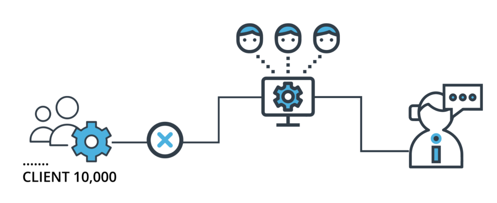
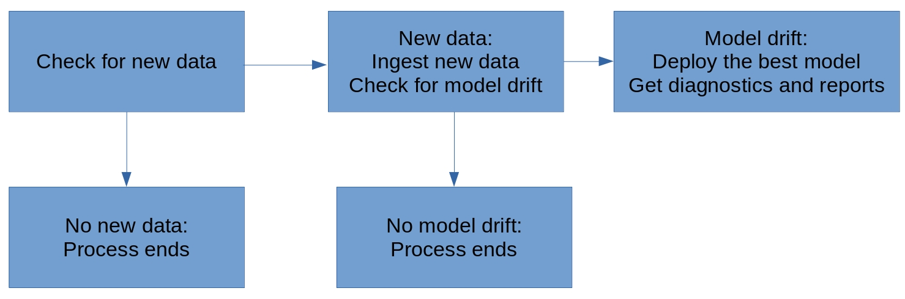

# Project: A Dynamic Risk Assessment System

## Background

Imagine that you're the Chief Data Scientist at a big company that has 10,000 corporate clients. Your company is extremely concerned about attrition risk: the risk that some of their clients will exit their contracts and decrease the company's revenue. They have a team of client managers who stay in contact with clients and try to convince them not to exit their contracts. However, the client management team is small, and they're not able to stay in close contact with all 10,000 clients.

The company needs you to create, deploy, and monitor a risk assessment ML model that will estimate the attrition risk of each of the company's 10,000 clients. If the model you create and deploy is accurate, it will enable the client managers to contact the clients with the highest risk and avoid losing clients and revenue.

Creating and deploying the model isn't the end of your work, though. Your industry is dynamic and constantly changing, and a model that was created a year or a month ago might not still be accurate today. Because of this, you need to set up regular monitoring of your model to ensure that it remains accurate and up-to-date. You'll set up processes and scripts to re-train, re-deploy, monitor, and report on your ML model, so that your company can get risk assessments that are as accurate as possible and minimize client attrition.

## Project Steps Overview

You'll complete the project by proceeding through 5 steps:

1. **Data ingestion**. Automatically check a database for new data that can be used for model training. Compile all training data to a training dataset and save it to persistent storage. Write metrics related to the completed data ingestion tasks to persistent storage.
2. **Training, scoring, and deploying**. Write scripts that train an ML model that predicts attrition risk, and score the model. Write the model and the scoring metrics to persistent storage.
3. **Diagnostics**. Determine and save summary statistics related to a dataset. Time the performance of model training and scoring scripts. Check for dependency changes and package updates.
4. **Reporting**. Automatically generate plots and documents that report on model metrics. Provide an API endpoint that can return model predictions and metrics.
5. **Process Automation**. Create a script and cron job that automatically run all previous steps at regular intervals.

## Project Submission

You'll submit a zip file that contains all of the scripts required for the project. Your zip file will also include reports from Step 4 that show the important model metrics for your model.

## Getting Started

We've provided you with a starter (click [here(opens in a new tab)](https://video.udacity-data.com/topher/2021/March/60412fe6_starter-file/starter-file.zip) to download) that contains template scripts for each of the project steps. The starter also contains fabricated datasets that you can use for model training.

### The Workspace

You'll complete the project in the Udacity Workspace, which you will find on the **Workspace** page in the current project lesson. The workspace contains all the computing resources needed to complete the project.

Your workspace has eight locations you should be aware of:

- `/home/workspace`, the root directory. When you load your workspace, this is the location that will automatically load. This is also the location of many of your starter files.
- `/practicedata/`. This is a directory that contains some data you can use for practice.
- `/sourcedata/`. This is a directory that contains data that you'll load to train your models.
- `/ingesteddata/`. This is a directory that will contain the compiled datasets after your ingestion script.
- `/testdata/`. This directory contains data you can use for testing your models.
- `/models/`. This is a directory that will contain ML models that you create for production.
- `/practicemodels/`. This is a directory that will contain ML models that you create as practice.
- `/production_deployment/`. This is a directory that will contain your final, deployed models.

**Important notes about the workspace:**

Your files under the `/home/workspace/` directory are saved for you automatically. However, after a **30 minutes** idle time (navigate away from the Workspace, tab not accessed, or simply closed, or laptop asleep, etc), your Workspace will go sleep. If you return after this period, your files will be restored to your most recent work, but you will lose the list of **open files** or any **shell sessions** you may have had running.

## Starter Files

There are many files in the starter: 10 Python scripts, one configuration file, one requirements file, and five datasets.

The following are the Python files that are in the starter files:

- **training.py**, a Python script meant to train an ML model
- **scoring.py,** a Python script meant to score an ML model
- **deployment.py**, a Python script meant to deploy a trained ML model
- **ingestion.py**, a Python script meant to ingest new data
- **diagnostics.py**, a Python script meant to measure model and data diagnostics
- **reporting.py**, a Python script meant to generate reports about model metrics
- **app.py**, a Python script meant to contain API endpoints
- **wsgi.py**, a Python script to help with API deployment
- **apicalls.py**, a Python script meant to call your API endpoints
- **fullprocess.py**, a script meant to determine whether a model needs to be re-deployed, and to call all other Python scripts when needed

The following are the datasets that are included in your starter files. Each of them is fabricated datasets that have information about hypothetical corporations.

**Note:** these data have been uploaded to your workspace as well

- dataset1.csv and dataset2.csv, found in `/practicedata/`
- dataset3.csv and dataset4.csv, found in `/sourcedata/`
- testdata.csv, found in `/testdata/`

The following are other files that are included in your starter files:

- **requirements.txt**, a text file and records the current versions of all the modules that your scripts use
- **config.json**, a data file that contains names of files that will be used for configuration of your ML Python scripts

# Step 1: Data Ingestion

Data ingestion is important because all ML models require datasets for training. Instead of using a single, static dataset, you're going to create a script that's flexible enough to work with constantly changing sets of input files. This step will make your data ingestion go smoothly and easily, even if the data itself is complex.

In this step, you'll read data files into Python, and write them to an output file that will be your master dataset. You'll also save a record of the files you've read.

## Starter Files

For this step, you'll be working with the starter file called **ingestion.py** as a template for your Python code.

You'll also be working with the **config.json** configuration file, and the two datasets (dataset1.csv and dataset2.csv) found in `/practicedata/`.

## Using config.json Correctly

It's important to understand your **config.json** starter file since you'll be using it throughout the project. This file contains configuration settings for your project.

This file contains five entries:

- `input_folder_path`, which specifies the location where your project will look for input data, to ingest, and to use in model training. If you change the value of `input_folder_path`, your project will use a different directory as its data source, and that could change the outcome of every step.
- `output_folder_path`, which specifies the location to store output files related to data ingestion. In the starter version of config.json, this is equal to `/ingesteddata/`, which is the directory where you'll save your ingested data later in this step.
- `test_data_path`, which specifies the location of the test dataset
- `output_model_path`, which specifies the location to store the trained models and scores.
- `prod_deployment_path`, which specifies the location to store the models in production.

When we're initially setting up the project, our config.json file will be set to read `practicedata` and write ****`practicemodels`**. **When we're ready to finish the project, you will need to change the locations specified in config.json so that we're reading our actual, `sourcedata` and we're writing to our `models` directory.

## Reading Data and Compiling a Dataset

In the first part of your data ingestion.py script, you'll read a collection of csv files into Python.

The location of the csv files you'll be working with is specified in the config.json starter file, in an entry called `input_folder_path`. In your starter version of config.py, this entry's value is set to the `/practicedata/` directory.

You need to add code to your ingestion.py starter file so that it can automatically detect all of the csv files in the directory specified in the `input_folder_path`. Each of the files in the `input_folder_path` represents a different dataset. You'll need to combine the data in all of these individual datasets into a **single pandas DataFrame.**

**You shouldn't manually write file names in your script**: your script needs to automatically detect every file name in the directory. Your script should work even if we change the number of files or the file names in the `input_folder_path`.

It's possible that some of the datasets that you read and combine will contain duplicate rows. So, you should **de-dupe** the single pandas DataFrame you create, and ensure that it only contains unique rows.

## Writing the Dataset

Now that you have a single pandas DataFrame containing all of your data, you need to write that dataset to storage in your workspace. You can save it to a file called ***finaldata.csv***. Save this file to the directory that's specified in the `output_folder_path` entry of your config.json configuration file. In your starter version of config.json, the output_folder_path entry is set to `/ingesteddata/`, so your dataset will be saved to `/ingesteddata/`.

## Saving a Record of the Ingestion

For later steps in the project, you'll need to have a record of which files you read to create your *finaldata.csv* dataset. You need to create a record of all of the files you read in this step, and save the record on your workspace as a Python list.

You can store this record in a file called ***ingestedfiles.txt***. This file should contain a list of the filenames of every .csv you've read in your ingestion.py script. You can also save this file to the directory that's specified in the `output_folder_path` entry of your config.json configuration file.

# Step 2: Training, Scoring, and Deploying

Training and Scoring an ML model is important because ML models are only worth deploying if they've been trained, and we're always interested in re-training in the hope that we can improve our model accuracy. Re-training and scoring, as we'll do in this step, are crucial so we can get the highest possible model accuracy.

This step will require you to write three scripts. One script will be for training an ML model, another will be for generating scoring metrics for the model, and the third will be for deploying the trained model.

### Starter Files

There are three Python template files that you should use for this step. All are in your collection of starter files:

- **training.py**, a Python script that will accomplish model training
- **scoring.py**, a Python script that will accomplish model scoring
- **deployment.py**, a Python script that will accomplish model deployment

For this step, you will also need *finaldata.csv*, one of the outputs of Step 1. The data in *finaldata.csv* represents records of corporations, their characteristics, and their historical attrition records. One row represents a hypothetical corporation. There are five columns in the dataset:

- **"corporation"**, which contains four-character abbreviations for names of corporations
- **"lastmonth_activity"**, which contains the level of activity associated with each corporation over the previous month
- **"lastyear_activity"**, which contains the level of activity associated with each corporation over the previous year
- **"number_of_employees"**, which contains the number of employees who work for the corporation
- **"exited"**, which contains a record of whether the corporation exited their contract (1 indicates that the corporation exited, and 0 indicates that the corporation did not exit)

The dataset's final column, **"exited"**, is the target variable for our predictions. The first column, "corporation", will not be used in modeling. The other three numeric columns will all be used as predictors in your ML model.

The directories where you will read and write your files are stored in the config.json file, which is also included in your starter files.

### Model Training

Build a function that accomplishes model training for an attrition risk assessment ML model. Your model training function should accomplish the following:

- Read in finaldata.csv using the pandas module. The directory that you read from is specified in the `output_folder_path` of your config.json starter file.
- Use the scikit-learn module to train an ML model on your data. The training.py starter file already contains a logistic regression model you should use for training.
- Write the trained model to your workspace, in a file called *trainedmodel.pkl*. The directory you'll save it in is specified in the `output_model_path` entry of your config.json starter file.

You can write code that will accomplish all of these steps in training.py, which is included in your starter files.

**Note:** this step is for you to have a trained model you can monitor and update later on and it's *not* about getting perfect model accuracy. So you don't need to spend a lot of time on improving the accuracy. It's good enough as long as you have an ML model that can make predictions.

### Model Scoring

You need to write a function that accomplishes model scoring. You can write this function in the starter file called scoring.py. To accomplish model scoring, you need to do the following:

- Read in test data from the directory specified in the `test_data_path` of your config.json file
- Read in your trained ML model from the directory specified in the `output_model_path` entry of your config.json file
- Calculate the F1 score of your trained model on your testing data
- Write the F1 score to a file in your workspace called latestscore.txt. You should save this file to the directory specified in the `output_model_path` entry of your config.json file

The F1 score is a single number, and it doesn't need to have any special formatting. An example of the contents of latestscore.txt could be the following:

`0.6352419`

You can write code that will accomplish all of these steps in scoring.py, which is included in your starter files.

### Model Deployment

Finally, you need to write a function that will deploy your model. You can write this function in the starter file called deployment.py.

Your model deployment function will not create new files; it will only copy existing files. It will copy your trained model (trainedmodel.pkl), your model score (latestscore.txt), and a record of your ingested data (ingestedfiles.txt). It will copy all three of these files from their original locations to a production deployment directory. The location of the production deployment directory is specified in the `prod_deployment_path` entry of your config.json starter file.

# Step 3: Diagnostics

Model and data diagnostics are important because they will help you find problems - if any exist - in your model and data. Finding and understanding any problems that might exist will help you resolve the problems quickly and make sure that your model performs as well as possible.

In this step, you'll create a script that performs diagnostic tests related to your model as well as your data.

### Starter File

You can write the code for this step in the file called **diagnostics.py**. This file is contained in your collection of starter files.

For this step, you'll also need the starter file called config.json. This file will specify the directories where you need to read and write files.

### Model Predictions

You need a function that returns predictions made by your deployed model.

This function should take an argument that consists of a dataset, in a pandas DataFrame format. It should read the deployed model from the directory specified in the `prod_deployment_path` entry of your config.json file.

The function uses the deployed model to make predictions for each row of the input dataset. Its output should be a list of predictions. This list should have the same length as the number of rows in the input dataset.

### Summary Statistics

You also need a function that calculates summary statistics on your data.

The summary statistics you should calculate are *means, medians,* and *standard deviations*. You should calculate each of these for each **numeric** column in your data.

This function should calculate these summary statistics for the dataset stored in the directory specified by `output_folder_path` in config.json. It should output a Python list containing all of the summary statistics for every numeric column of the input dataset.

### Missing Data

Next, you should write a function to check for missing data. By missing data, we mean **NA** values. Remember that the Pandas module has a custom method for checking whether a value is NA.

Your function needs to count the number of NA values in each column of your dataset. Then, it needs to calculate what **percent** of each column consists of NA values.

The function should count missing data for the dataset stored in the directory specified by `output_folder_path` in config.json. It will return a list with the same number of elements as the number of columns in your dataset. Each element of the list will be the percent of NA values in a particular column of your data.

### Timing

Next, you should create a function that times how long it takes to perform the important tasks of your project. The important tasks you need to time are: data ingestion (your ingestion.py script from Step 1) and model training (your training.py script from Step 2).

This function doesn't need any input arguments. It should return a Python list consisting of two timing measurements in seconds: one measurement for data ingestion, and one measurement for model training.

### Dependencies

Python scripts, including the ones you've written for this project, usually depend on third-party modules. It's important to make sure that the modules you're importing are up-to-date.

In this step, you'll write a function that checks the current and latest versions of all the modules that your scripts use (the current version is recorded in **requirements.txt**). It will output a table with three columns: the first column will show the name of a Python module that you're using; the second column will show the currently installed version of that Python module, and the third column will show the most recent available version of that Python module.

To get the best, most authoritative information about Python modules, you should rely on Python's official package manager, **pip**. Your script should run a pip command in your workspace Terminal to get the information you need for this step.

**Note:** Dependencies don’t need to be re-installed or changed, since this is just a check.

# Step 4: Reporting

Model reporting is important because reporting allows us as data scientists to be aware of all aspects of our data, our model, and our training processes, as well as their performance. Also, automated reporting enables us to keep stakeholders and leaders quickly and reliably informed about our ML efforts.

In this step, you'll write scripts that create reports related to your ML model, its performance, and related diagnostics.

### Starter Files

For this step, you're going to work with two scripts from our collection of starter files: **reporting.py** - which we'll use for generating plots, and **app.py** - which we'll use for API setup.

### Generating Plots

You need to update the **reporting.py** script so that it generates plots related to your ML model's performance.

In order to generate plots, you need to call the model prediction function that you created diagnostics.py in Step 3. The function will use the **test data** from the directory specified in the `test_data_path` entry of your config.json starter file as input dateset. You can use this function to obtain a list of predicted values from your model.

After you obtain predicted values and actual values for your data, you can use these to generate a **confusion matrix** plot. Your reporting.py script should save your confusion matrix plot to a file in your workspace called *confusionmatrix.png*. The confusionmatrix.png file can be saved in the directory specified in the `output_model_path` entry of your config.json file.

### API Setup

You need to set up an API using **app.py** so that you and your colleagues can easily access ML diagnostics and results. Your API needs to have four endpoints: one for model predictions, one for model scoring, one for summary statistics, and one for other diagnostics.

**Note:** Each of your endpoints should return an HTTP 200 status code.

#### Prediction Endpoint

You can set up a prediction endpoint at `/prediction`. This endpoint should take a dataset's file location as its input, and return the outputs of the prediction function you created in Step 3.

#### Scoring Endpoint

You can set up a scoring endpoint at `/scoring`. This endpoint needs to run the scoring.py script you created in Step 2 and return its output.

#### Summary Statistics Endpoint

You can set up a summary statistics endpoint at `/summarystats`. This endpoint needs to run the summary statistics function you created in Step 3 and return its outputs.

#### Diagnostics Endpoint

You can set up a diagnostics endpoint at `/diagnostics`. This endpoint needs to run the timing, missing data, and dependency check functions you created in Step 3 and return their outputs.

### Calling your API endpoints

Work with the starter file called **apicalls.py**. This script should call each of your endpoints, combine the outputs, and write the combined outputs to a file call apireturns.txt. When you call the prediction endpoint, you can use the file `/testdata/testdata.csv` as your input, to get predictions on the test data. When you call the other endpoints, you don't need to specify any inputs. The apireturns.txt file can be saved in the directory specified in the `output_model_path` entry of your config.json file.

# Step 5: Process Automation

Process automation is important because it will eliminate the need for you to manually perform the individual steps of the ML model scoring, monitoring, and re-deployment process.

In this step, you'll create scripts that automate the ML model scoring and monitoring process.

This step includes checking for the criteria that will require model re-deployment, and re-deploying models as necessary.

The full process that you'll automate is shown in the following figure:

### Starter File

For this step, you can work with the starter file called **fullprocess.py.** Your `fullprocess.py` file will call functions from scripts that you wrote in previous steps, including `deployment.py` from Step 1.

### Updating config.json

The starter version of your config.json file contains an entry called `input_folder_path` with a value equal to `/practicedata/`. All of the training, scoring, and reporting in Steps 1 through 4 was accomplished relying on the contents of this directory. As the name "practicedata" suggests, this folder's datasets were provided to help you practice and test your scripts. Now that you've completed all of the scripts in Steps 1 through 4, we want to stop working with practice data and start working with production data. There's production data provided to you in your workspace in the folder called `/sourcedata/`.

Changing from practice data to production data only requires changing one thing. You need to change the `input_folder_path` entry in your config.json file. Instead of `/practicedata/`, you need to change it to be `/sourcedata/`. Since all of your scripts read this value from config.json, making that one change will enable all of your scripts to work with this new, correct data instead of our practice data.

In addition to changing your `input_folder_path`, you should also change your `output_model_path`. In the starter version of config.json, the value for this entry is set to `/practicemodels/`. You should change it to `/models/` for storing production models instead of practice models.

### Checking and Reading New Data

The first part of your script needs to check whether any new data exists that needs to be ingested.

You'll accomplish the check for new data in two steps:

1. Your script will have to read the file *ingestedfiles.txt* from the **deployment directory**, specified in the `prod_deployment_path` entry of your config.json file.
2. Your script will check the directory specified in the `input_folder_path` entry of config.json, and determine whether there are any files there that are not in the list from *ingestedfiles.txt*.

If there are any files in the `input_folder_path` directory that are not listed in *ingestedfiles.txt*, then your script needs to run the code in **ingestion.py** to ingest all the new data.

### Deciding Whether to Proceed (first time)

If you found in the previous step that there is no new data, then there will be no way to train a new model, and so there will be no need to continue with the rest of the deployment process. Your script will only continue to the next step (checking for model drift) if you found and ingested new data in the previous step.

### Checking for Model Drift

The next part of your script needs to check for model drift. You can accomplish this with the following steps:

1. Read the score from the **latest model**, recorded in *latestscore.txt* from the **deployment directory**, specified in the `prod_deployment_path` entry of your config.json file.
2. Make predictions using the `trainedmodel.pkl` model in the `/production_deployment` directory and the **most recent** data you obtained from the previous "Checking and Reading New Data" step.
3. Get a score for the **new predictions** from step 2 by running the *scoring.py*.
4. Check whether the new score from step 3 is higher or lower than the score recorded in *latestscore.txt* in step 1 using the raw comparison test. If the score from step 3 is **lower**, then model drift has occurred. Otherwise, it has not.

### Deciding Whether to Proceed (second time)

If you found in the previous step that there is no model drift, then the current model is working well and there's no need to replace it, so there will be no need to continue with the rest of the deployment process. Your script will only continue to the next step (re-training and re-deployment) if you found evidence for model drift in the previous step.

### Re-training

Train a new model using the **most recent** data you obtained from the previous "Checking and Reading New Data" step. You can run *training.py* to complete this step. When you run training.py, a model trained on the most recent data will be saved to your workspace.

### Re-deployment

To perform re-deployment, you need to run the script called *deployment.py*. The model you need to deploy is the model you saved when you ran training.py in the "Checking for Model Drift" section above.

### Diagnostics and Reporting

The last part of your script should run the code from *apicalls.py* and *reporting.py* on the most recently deployed model (the model you deployed in the previous "re-deployment" section). When you run reporting.py, you'll create a new version of confusionmatrix.png, which will be saved in the `/models/` directory. When you run apicalls.py, you'll create a new version of apireturns.txt, which will be saved in the `/models/` directory. You should save these new versions for your final submission. When you prepare your final submission, you can change the names of these files to confusionmatrix2.png and apireturns2.txt, respectively, so they don't get confused with the previous files you created.

### Cron Job for the Full Pipeline

Now you have a script, fullprocess.py, that accomplishes all of the important steps in the model deployment, scoring, and monitoring process. But it's not enough just to have the script sitting in our workspace - we need to make sure the script runs regularly without manual intervention.

To accomplish this, you'll write a crontab file that runs the fullprocess.py script one time **every 10 min.**

To successfully install a crontab file that runs your fullprocess.py script, you need to make sure to do the following:

1. In the command line of your workspace, run the following command: `service cron start`
2. Open your workspace's crontab file by running `crontab -e` in your workspace's command line. Your workspace may ask you which text editor you want to use to edit the crontab file. You can select option `3`, which corresponds to the "vim" text editor.
3. When you're using vim to edit the crontab, you need to press the "`i`" key to be able to insert a cron job.
4. After you write the cron job in the crontab file, you can save your work and exit vim by pressing the escape key, and then typing "`:wq`" , and then press Enter. This will save your one-line cron job to the crontab file and return you to the command line. If you want to view your crontab file after exiting vim, you can run `crontab -l` on the command line.

You should save and submit a copy of the one-line cron job you wrote as "cronjob.txt" .

Congratulations, you've completed the final step!

# Standout Suggestions (Optional)

## PDF reports

In Step 4 "Reporting", you set up a script that generates a plot of a confusion matrix. Instead of outputting just that raw plot, set up a script that generates a pdf file that contains the plot as well as summary statistics and other diagnostics. This enables more complete, quicker reporting that will really make your project stand out.

In order to accomplish this suggestion, you'll need to add to your reporting.py Python script. You may also need to install modules that enable PDF creation, such as the reportlab module. There are many things you could include in a PDF report about your model: you could include the confusion matrix you generate in reporting.py, you could include all of the outputs of API endpoints you created in app.py, and you could also include the model's F1 score (stored in latestscore.txt) and the files that you ingested to train the model (stored in ingestedfiles.txt).

## Time Trends

Give your scripts the ability to store diagnostics from previous iterations of your model, and generate reports about time trends. For example, show how the percent of NA elements has gone up or down over many weeks or months, or show whether the timing of ingestion and training has increased or decreased.

You could accomplish this suggestion in several different ways. For example, you could create a directory called `/olddiagnostics/`, and create a script that copied all of your diagnostics outputs to that folder. You could also add timestamps to the filenames of your output files like ingestedfiles.txt and latestscore.txt.

## Database setup

Instead of writing results and files to .txt and .csv files, write your datasets and records to SQL databases. This will lead to increased performance and reliability.

In order to accomplish this suggestion, you'll have to set up SQL databases in your workspace. You can accomplish this within Python by installing and using the mysql-connector-python module. You could create a new Python script called dbsetup.py that used this module to set up databases. You could set up a database that stored information about ingested files, another one to store information about model scores, and another one to store information about model diagnostics. Then, you would have to alter ingestion.py, scoring.py, and diagnostics.py so that they wrote to these databases every time they were run.

# Rubric

## Data Ingestion

| Criteria                                                                                 | Submission Requirements                                                                                                                                                                                                                                                                                                                                          |
| ---------------------------------------------------------------------------------------- | ---------------------------------------------------------------------------------------------------------------------------------------------------------------------------------------------------------------------------------------------------------------------------------------------------------------------------------------------------------------- |
| Student will be able to pdate the training data for ML models to prepare for re-training | - The ingestion.py script should perform this step. - Every file contained in the data folder needs to be read into Python. - All files should be compiled into a pandas data frame and written to a csv file called “finaldata.csv”. De-dupe the compiled data frame before saving. - Store the ingestion record in a file called “ingestedfiles.txt”. |

## Training, Scoring, and Deployment

| Criteria                                                                                        | Submission Requirements                                                                                                                  |
| ----------------------------------------------------------------------------------------------- | ---------------------------------------------------------------------------------------------------------------------------------------- |
| Student will be able to write a script that trains an ML model and writes the model to storage. | Students should write training.py to accomplish this. The model should be saved in the pickle format.                                    |
| Student will be able to write a script that performs scoring of ML models                       | Students should write a scoring script in the scoring.py starter file. Scoring should be performed using the F1 score.                   |
| Student will be able to write ML model scores to persistent storage in files or databases.      | The scoring.py script should write the F1 score to a .txt file called latestscore.txt.                                                   |
| Student will be able to regularly re-deploy models                                              | The deployment.py script should copy the trained model, the F1 score, and the ingested file record to a production deployment directory. |

## Diagnostics

| Criteria                                                                                                                   | Submission Requirements                                                                                                                                                                                                                                                                                                                    |
| -------------------------------------------------------------------------------------------------------------------------- | ------------------------------------------------------------------------------------------------------------------------------------------------------------------------------------------------------------------------------------------------------------------------------------------------------------------------------------------ |
| Student will be able to write a script to automatically check the latency of model training and model prediction processes | - The diagnostics.py script should perform this step. - Timing should be checked for both data ingestion and training in seconds. - Summary statistics (means, medians, and modes) should be checked for each numeric column. - Students will create a function for making predictions based on the deployed model and a dataset. |
| Student will be able to check data integrity and stability                                                                 | - The diagnostics.py script should perform this step. - Data integrity should be checked by measuring the percentage of NA values in each of the numeric dataset’s columns.                                                                                                                                                             |
| Student will be able to check for dependency changes in scripts                                                            | - The diagnostics.py script should perform this step. - All modules in requirements.txt need to have their latest versions and currently installed versions checked.                                                                                                                                                                    |

## Reporting

| Criteria                                                                                             | Submission Requirements                                                                                                                                                                                                                                                                                                                                                                                                                                                                                                                                                                                                                                                                                                                                                                                                                                                                                                                                                                                     |
| ---------------------------------------------------------------------------------------------------- | ----------------------------------------------------------------------------------------------------------------------------------------------------------------------------------------------------------------------------------------------------------------------------------------------------------------------------------------------------------------------------------------------------------------------------------------------------------------------------------------------------------------------------------------------------------------------------------------------------------------------------------------------------------------------------------------------------------------------------------------------------------------------------------------------------------------------------------------------------------------------------------------------------------------------------------------------------------------------------------------------------------- |
| Student will be able to create API's that provide easy automated access to ML model scoring results. | The app.py script will perform this section.  - An endpoint for scoring needs to provide model scores based on test datasets and models (found in /testdata/). - An endpoint for summary statistics needs to provide summary statistics for the ingested data (found in the directory specified by the output_folder_path in config.json) - An endpoint for diagnostics needs to provide diagnostics for the ingested data (found in the directory specified by the output_folder_path in config.json). The diagnostics should include timing, dependency checks, and missing data checks. - An endpoint for model predictions needs to return predictions from the deployed model (found in the directory specified in the prod_deployment path in config.json) for an input dataset (passed to the endpoint as an input)  Students will create a function in reporting.py that generates a confusion matrix that shows the accuracy of the model on test data (found in /testdata/). |
| Student will be able to call ML scoring API's and use their data in reports.                         | In apicalls.py, call API’s to get the model predictions, accuracy score, summary statistics, and diagnostics that are returned by the API endpoints. The apicalls.py script needs to combine these API outputs and write the combined outputs to the workspace, to a file called apireturns.txt.                                                                                                                                                                                                                                                                                                                                                                                                                                                                                                                                                                                                                                                                                                            |

## Process Automation

| Criteria                                                                                      | Submission Requirements                                                                                                                                                                                                                                                                                                                                                                                                                                                                                                            |
| --------------------------------------------------------------------------------------------- | ---------------------------------------------------------------------------------------------------------------------------------------------------------------------------------------------------------------------------------------------------------------------------------------------------------------------------------------------------------------------------------------------------------------------------------------------------------------------------------------------------------------------------------- |
| Student will be able to determine whether ML models need to be updated based on model scores. | - The fullprocess.py script will perform this section. - Check for the presence of non-ingested data in the /sourcedata/ folder - Check for whether the most recent model performs better than the previously deployed model                                                                                                                                                                                                                                                                                                 |
| Student will be able to regularly re-deploy the latest models to production.                  | - In deployment.py, copy the model from its initial location to the final production deployment directory. The initial location is specified in the output_folder_path of config.json. The production deployment directory is specified in the prod_deployment_path of config.json. - Students need to set up a cron job that regularly runs fullprocess.py. - The fullprocess.py script should call the deployment.py script only under certain conditions: when there is new data ingested, AND when there is model drift. |

### Suggestions to Make Your Project Stand Out

1. Generate pdf reports that contain one or more plots, plus model diagnostics and summary statistics.
2. Store and analyze data related to time trends, including changes in latency and missing values percentages.
3. Store datasets and records in SQL databases instead of .csv and .txt files.

